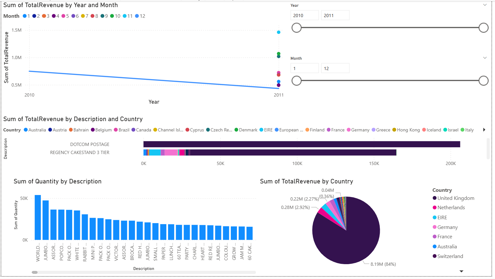

# Power BI Sales Dashboard

## Objective
This project demonstrates the use of **Power BI** to analyze sales data. The dashboard includes interactive visualizations such as **Total Revenue by Product**, **Sales by Country**, **Quantity Sold by Product**, and more. The goal is to provide an insightful and interactive way to explore sales data and track performance.

## Live Demo
Check out the live demo of the project: [Link to Power BI Report]

## Screenshots
##Result

## How It Works
- **Data**: The dashboard uses **sales data** from the **Online Retail** dataset.
- **Preprocessing**:
  - Data was cleaned and transformed in **Power Query Editor** (e.g., handling missing data, transforming columns).
  - **Total Revenue** was calculated by multiplying **Quantity** by **UnitPrice**.
- **Model**: The visualizations include interactive elements like **Slicers** for **Year**, **Month**, and **Country**.
- **App**: This is a **Power BI dashboard**, allowing users to explore sales performance and trends dynamically.

## Tech Stack
- **Power BI**: Used for building the dashboard and creating interactive visualizations.
- **Excel**: Data source for the analysis.
- **Power Query Editor**: Used for cleaning and transforming the data.

## Features
- **Total Revenue Over Time:** Line chart showing how revenue changes year over year.
- **Sales by Country:** Pie chart displaying the distribution of total revenue across different countries.
- **Top Products by Revenue:** Bar chart visualizing total revenue by product description.
- **Quantity Sold by Product:** Column chart showing quantity sold for each product.
